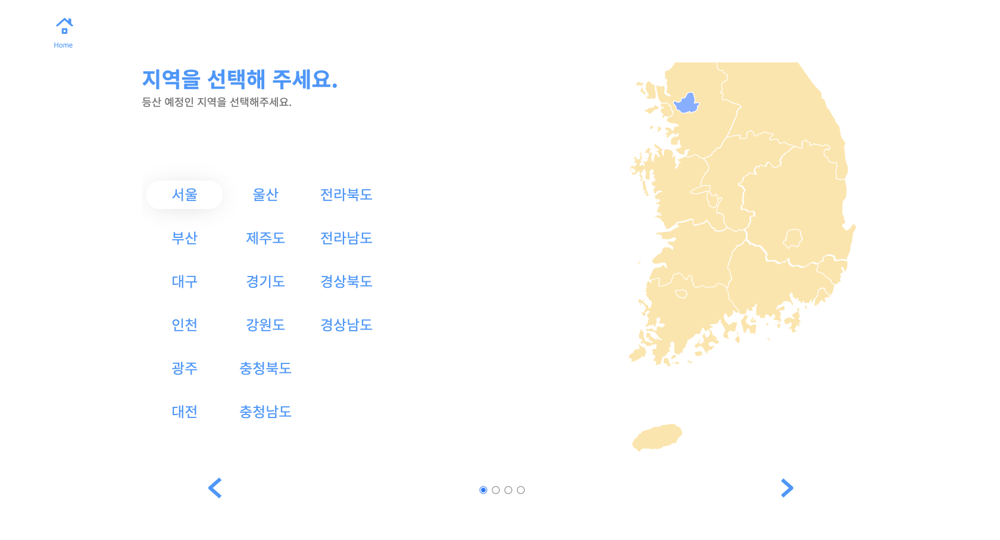
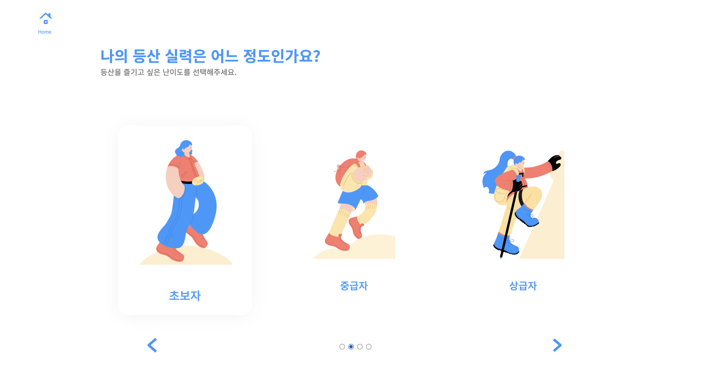
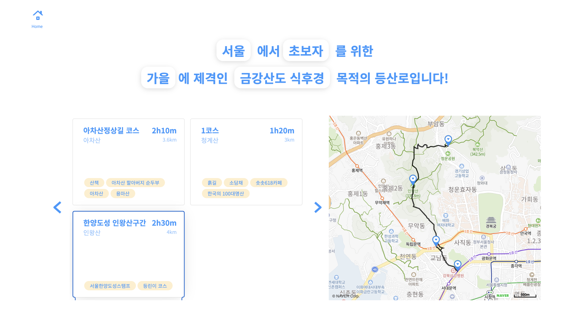

# 🏔 산 넘어 산 🏔
나의 수준이나 기호에 맞는 등산코스를 추천해주는 웹 사이트입니다. 
4단계 질문에 대한 답을 선택하면 선택한 옵션에 맞는 등산로를 지도와 함께 보여줍니다.

[⛰ 등산로 찾기 ⛰](http://sannumsan.s3-website.ap-northeast-2.amazonaws.com)


## 목차 
- [구현 내용](#1)
- [회고](#2)
- [기술 스택](#3)
- [실행 방법](#4)

## 구현 내용  <a id="1"></a>

### 시작 페이지


### 지역 선택 페이지


### 난이도 선택 페이지


### 활동 선택 페이지


### 결과 페이지


## 회고  <a id="2"></a>

- [프로젝트 1주차 회고](https://github.com/hyejineee/sannumsan/blob/master/retrospect/week9.md)
- [프로젝트 2주차 회고](https://github.com/hyejineee/sannumsan/blob/master/retrospect/week10.md)
- [프로젝트 3주차 회고](https://github.com/hyejineee/sannumsan/blob/master/retrospect/week11.md)
- [프로젝트 4주차 회고](https://github.com/hyejineee/sannumsan/blob/master/retrospect/week12.md)

- [2022 프로젝트 정리 회고](https://hyejineee.github.io/blog/sannumsan-refactoring)

## 기술 스택  <a id="3"></a>
    

## 실행 방법  <a id="4"></a>

1. 프로젝트를 클론합니다.
```
git clone https://github.com/hyejineee/sannumsan.git
```
2. 클론한 프로젝트 내부로 이동합니다. 
```
cd sannumsan
```
3. 의존 패키지를 설치합니다. 
```
yarn
```
4. 네이버 지도 사용을 위해 .env 파일을 추가합니다. .env 파일의 내용은 다음과 같습니다.
```
# naver-map

MAP_CLIENT_ID=
```
5. 다음 명령어를 사용하여 서버를 실행합니다.
```
# 서버 실행 
yarn dev 

# 테스트 실행
yarn test
```
